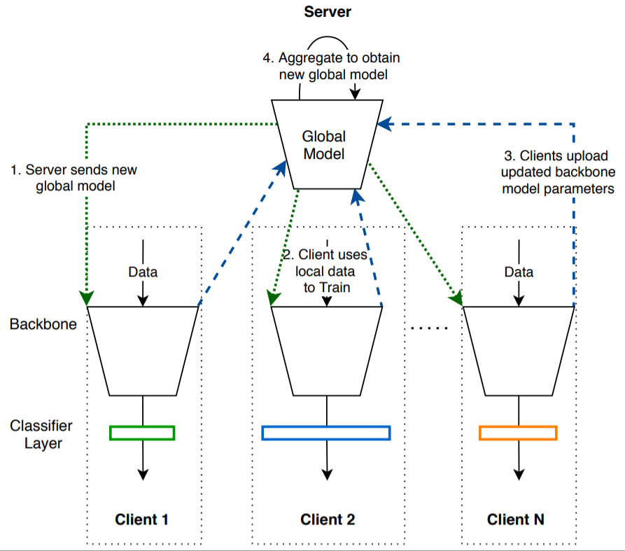
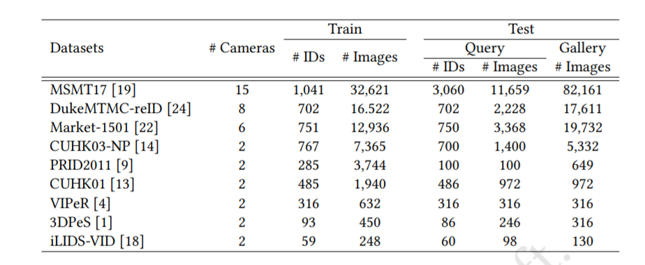

# Federated Person Re-identification (FedReID)

Personal re-identification is an important computer vision task, but its development is constrained by the increasing privacy concerns. Federated learning is a privacy-preserving machine learning technique that learns a shared model across decentralized clients. We implement federated learning to person re-identification (**FedReID**) and optimize its performance affected by **statistical heterogeneity** in the real-world scenarios. 

This is code for ACMMM 2020 oral paper - **[Performance Optimization for Federated Person Re-identification via Benchmark Analysis](https://arxiv.org/abs/2008.11560)**

Algorithm: Federated Partial Averaging (FedPav)



## Prerequisite

It requires the following Python libraries:
```
torch
torchvision
easyfl
```

Please refer to the [documentation](https://easyfl.readthedocs.io/en/latest/get_started.html#installation) to install `easyfl`.

## Datasets

**We use 9 popular ReID datasets for the benchmark.**


> **🎉 We are now releasing the processed datasets.** (April, 2022)
>
> Please [email us](weiming001@e.ntu.edu.sg) to request for the datasets with:
> 1. A short self-introduction.
> 2. The purposes of using these datasets.
>
> *⚠️ Further distribution of the datasets are prohibited.*

## Run the experiments

Put the processed datasets in `data_dir` and run the experiments with the following scripts.

```
python main.py --data_dir ${data_dir}
```

You can refer to the `main.py` to run experiments with more options and configurations.

> Note: you can run experiments with multiple GPUs by setting `--gpu`. The default implementation supports running with multiple GPUs in a _slurm cluster_. You may need to modify `main.py` to use `multiprocess`.

You may refer to the [original implementation](https://github.com/cap-ntu/FedReID) for the optimization methods: knowledge distillation and weight adjustment.

    
## Citation
```
@inproceedings{zhuang2020performance,
  title={Performance Optimization of Federated Person Re-identification via Benchmark Analysis},
  author={Zhuang, Weiming and Wen, Yonggang and Zhang, Xuesen and Gan, Xin and Yin, Daiying and Zhou, Dongzhan and Zhang, Shuai and Yi, Shuai},
  booktitle={Proceedings of the 28th ACM International Conference on Multimedia},
  pages={955--963},
  year={2020}
}
```

