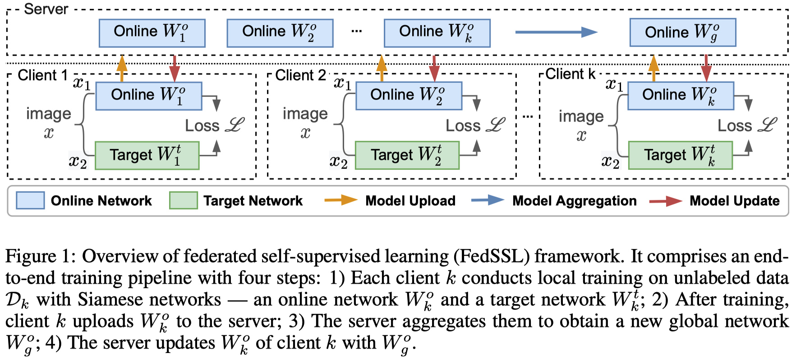

# Federated Self-supervised Learning (FedSSL)
> Also name as Federated Unsupervised Representation Learning (FedU)

A common limitation of existing federated learning (FL) methods is that they heavily rely on data labels on decentralized clients. We propose federated self-supervised learning framework (FedSSL) to learn visual representations from decentralized data without labels. 

This repository is the code for two papers:
- Divergence-aware Federated Self-Supervised Learning, _ICLR'2022_. [[paper]](https://openreview.net/forum?id=oVE1z8NlNe)
- Collaborative Unsupervised Visual Representation Learning From Decentralized Data, _ICCV'2021_. [[paper]](https://openaccess.thecvf.com/content/ICCV2021/html/Zhuang_Collaborative_Unsupervised_Visual_Representation_Learning_From_Decentralized_Data_ICCV_2021_paper.html)



The framework implements four self-supervised learning (SSL) methods based on Siamese networks in the federated manner:
1. BYOL
2. SimSiam
3. MoCo (MoCoV1 & MoCoV2)
4. SimCLR

## Training

You can conduct training using different FedSSL methods and our proposed FedEMA method. 

> You need to save the global model for further evaluation. 

### FedEMA

Run FedEMA with auto scaler $\tau=0.7$
```shell
python applications/fedssl/main.py --task_id fedema --model byol \
      --aggregate_encoder online --update_encoder dynamic_ema_online --update_predictor dynamic_dapu \
      --auto_scaler y --auto_scaler_target 0.7 2>&1 | tee log/${task_id}.log
```

Run FedEMA with constant weight scaler $\lambda=1$:
```shell
python applications/fedssl/main.py --task_id fedema --model byol \
      --aggregate_encoder online --update_encoder dynamic_ema_online --update_predictor dynamic_dapu \
      --weight_scaler 1 2>&1 | tee log/${task_id}.log
```

### Other SSL methods
Run other FedSSL methods: 
```shell
python applications/fedssl/main.py --task_id fedbyol --model byol  \
      --aggregate_encoder online --update_encoder online --update_predictor global
```
Replace `byol` in `--model byol` with other ssl methods, including `simclr`, `simsiam`, `moco`, `moco_v2` 

## Evaluation

You can evaluate the saved model with either linear evaluation and semi-supervised evaluation.

### Linear Evaluation
```shell
python applications/fedssl/linear_evaluation.py --dataset cifar10 \
      --model byol --encoder_network resnet18 \
      --model_path <path to the saved model with postfix '.pth'> \
      2>&1 | tee log/linear_evaluation.log
```

### Semi-supervised Evaluation
```shell
python applications/fedssl/semi_supervised_evaluation.py --dataset cifar10 \
      --model byol --encoder_network resnet18 \
      --model_path <path to the saved model with postfix '.pth'> \
      --label_ratio 0.1 --use_MLP 
      2>&1 | tee log/semi_supervised_evaluation.log
```

## File Structure
```
├── client.py <client implementation of federated learning>
├── communication.py <constants for model update>
├── dataset.py <dataset for semi-supervised learning>
├── eval_dataset <dataset preprocessing for evaluation>
├── knn_monitor.py <kNN monitoring>
├── main.py <file for start running>
├── model.py <ssl models>
├── resnet.py <network architectures used>
├── server.py <server implementation of federated learning>
├── transform.py <image transformations>
├── linear_evaluation.py <linear evaluation of models after training>
├── semi_supervised_evaluation.py <semi-supervised evaluation of models after training>
├── transform.py <image transformations>
└── utils.py 
```

## Citation

If you use these codes in your research, please cite these projects.

```
@inproceedings{zhuang2022fedema,
  title={Divergence-aware Federated Self-Supervised Learning},
  author={Weiming Zhuang and Yonggang Wen and Shuai Zhang},
  booktitle={International Conference on Learning Representations},
  year={2022},
  url={https://openreview.net/forum?id=oVE1z8NlNe}
}

@inproceedings{zhuang2021fedu,
  title={Collaborative Unsupervised Visual Representation Learning from Decentralized Data},
  author={Zhuang, Weiming and Gan, Xin and Wen, Yonggang and Zhang, Shuai and Yi, Shuai},
  booktitle={Proceedings of the IEEE/CVF International Conference on Computer Vision},
  pages={4912--4921},
  year={2021}
}

@article{zhuang2022easyfl,
  title={Easyfl: A low-code federated learning platform for dummies},
  author={Zhuang, Weiming and Gan, Xin and Wen, Yonggang and Zhang, Shuai},
  journal={IEEE Internet of Things Journal},
  year={2022},
  publisher={IEEE}
}
```
