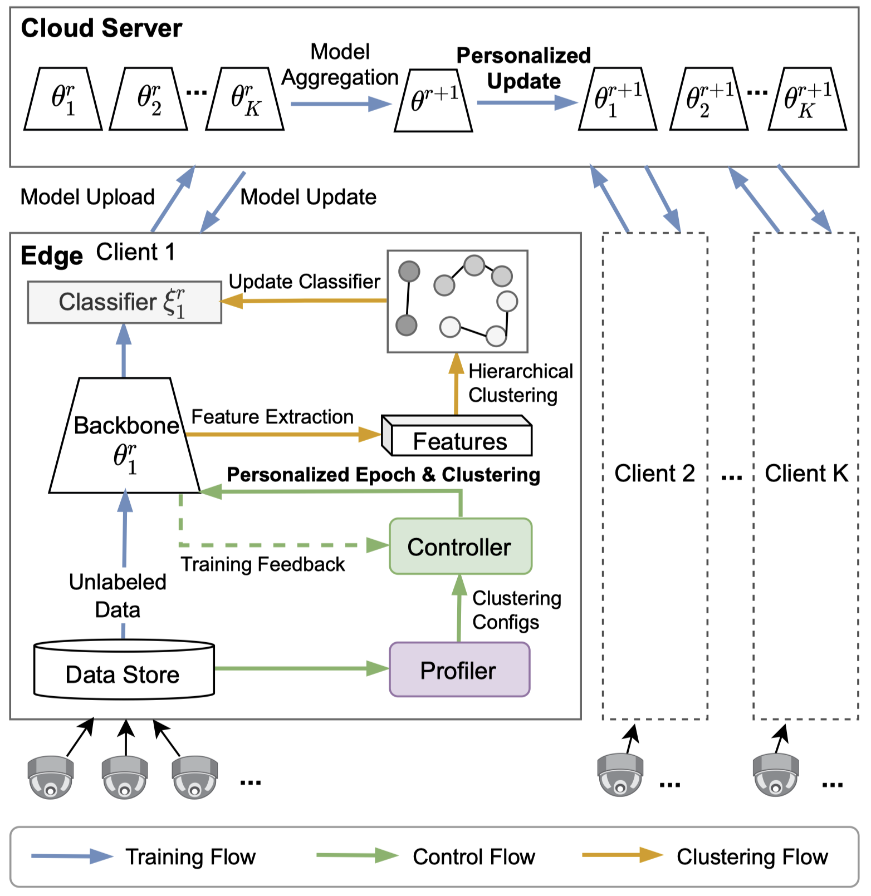
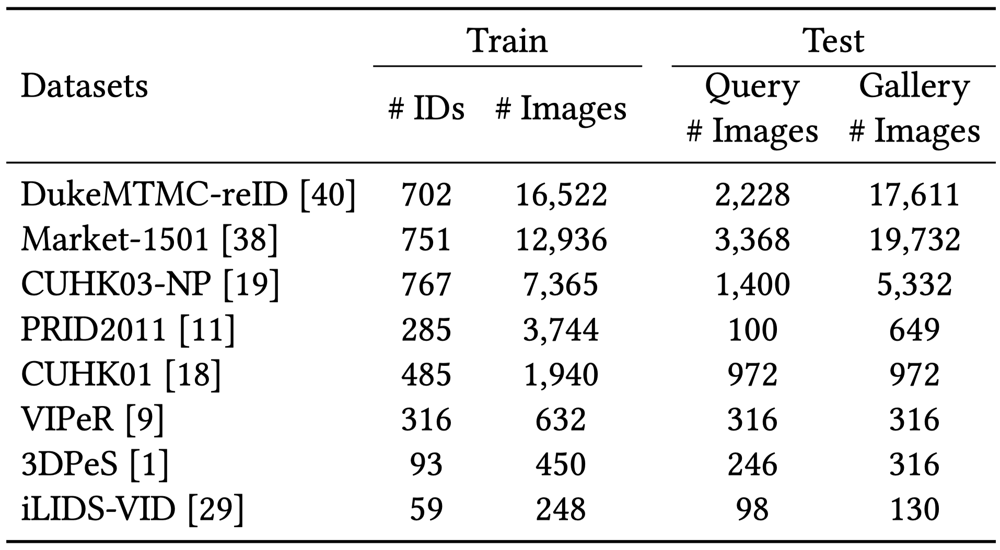
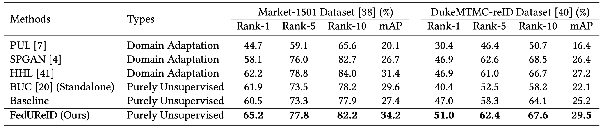

# Federated Unsupervised Person Re-identification (FedUReID)

This repository implements federated unsupervised person re-identification (FedUReID). FedUReID learnS person ReID models without any labels while preserving privacy. FedUReID enables in-situ model training on edges with unlabeled data. A cloud server aggregates models from edges instead of centralizing raw data to preserve data privacy. Extensive experiments on eight person ReID datasets demonstrate that FedUReID not only achieves higher accuracy but also reduces computation cost by 29%.

The paper is accepted in ACMMM 2021 - **[Joint optimization in edge-cloud continuum for federated unsupervised person re-identification](https://arxiv.org/abs/2108.06493)**

System architecture and workflow.



## Prerequisite

It requires the following Python libraries:
```
torch
torchvision
easyfl
scikit_learn==0.22.2.post1
```

Please refer to the [documentation](https://easyfl.readthedocs.io/en/latest/get_started.html#installation) to install `easyfl`.

## Datasets

**We use 8 popular ReID datasets for the benchmark.**


>
> Please [email us](weiming001@e.ntu.edu.sg) to request for the datasets with:
> 1. A short self-introduction.
> 2. The purposes of using these datasets.
>
> *⚠️ Further distribution of the datasets are prohibited.*

## Run the experiments

Put the processed datasets in `data_dir` and run the experiments with the following scripts.

```
python main.py --data_dir ${data_dir} --dataset Market Duke cuhk03 cuhk01 prid viper 3dpes ilids
```

You can refer to the `main.py` to run experiments with more options and configurations.

> Note: you can run experiments with multiple GPUs by setting `--gpu`. The default implementation supports running with multiple GPUs in a _slurm cluster_. You may need to modify `main.py` to use `multiprocess`.

Currently, we provide the implementation of the baseline and personalized epoch method described in the paper. 

## Results




## Citation
```
@inproceedings{zhuang2021fedureid,
  title={Joint optimization in edge-cloud continuum for federated unsupervised person re-identification},
  author={Zhuang, Weiming and Wen, Yonggang and Zhang, Shuai},
  booktitle={Proceedings of the 29th ACM International Conference on Multimedia},
  pages={433--441},
  year={2021}
}

@inproceedings{zhuang2020fedreid,
  title={Performance Optimization of Federated Person Re-identification via Benchmark Analysis},
  author={Zhuang, Weiming and Wen, Yonggang and Zhang, Xuesen and Gan, Xin and Yin, Daiying and Zhou, Dongzhan and Zhang, Shuai and Yi, Shuai},
  booktitle={Proceedings of the 28th ACM International Conference on Multimedia},
  pages={955--963},
  year={2020}
}

@article{zhuang2023fedreid,
  title={Optimizing performance of federated person re-identification: Benchmarking and analysis},
  author={Zhuang, Weiming and Gan, Xin and Wen, Yonggang and Zhang, Shuai},
  journal={ACM Transactions on Multimedia Computing, Communications and Applications},
  volume={19},
  number={1s},
  pages={1--18},
  year={2023},
  publisher={ACM New York, NY}
}
```

