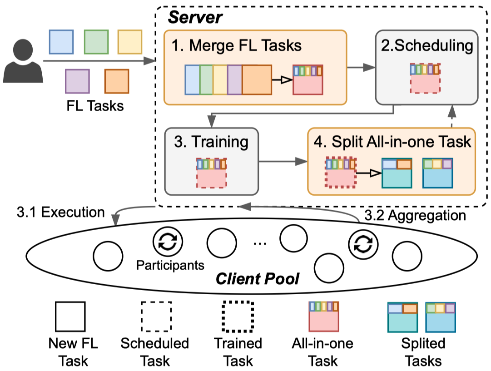
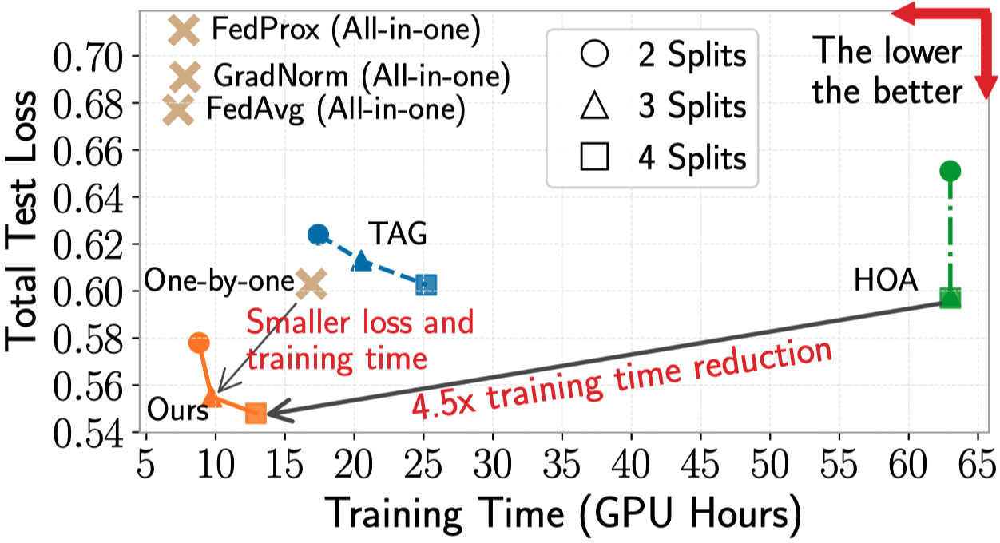

# MAS: Towards Resource-Efficient Federated Multiple-Task Learning


This repository is the official release of the paper accepted to ICCV 2023 - **[MAS: Towards Resource-Efficient Federated Multiple-Task Learning](https://arxiv.org/abs/2307.11285)**

In this work, we propose the first federated learning (FL) system to effectively coordinate and train multiple simultaneous FL tasks. We first formalize the problem of training simultaneous FL tasks. Then, we present our new approach, MAS (Merge and Split), to optimize the performance of training multiple simultaneous FL tasks. MAS starts by merging FL tasks into an all-in-one FL task with a multi-task architecture. After training for a few rounds, MAS splits the all-in-one FL task into two or more FL tasks by using the affinities among tasks measured during the all-in-one training. It then continues training each split of FL tasks based on model parameters from the all-in-one training. Extensive experiments demonstrate that MAS outperforms other methods while reducing training time by 2x and reducing energy consumption by 40%. We hope this work will inspire the community to further study and optimize training simultaneous FL tasks.


|  | 
|:--:| 
| *The architecture and workflow of our proposed <u>M</u>erge <u>a</u>nd <u>S</u>plit (MAS)* |

## Prerequisite

It requires the following Python libraries:
```
torch
torchvision
easyfl
```

Please refer to the [documentation](https://easyfl.readthedocs.io/en/latest/get_started.html#installation) to install `easyfl`.

Note that some other libraries should be installed to start training.

We referenced some implementations from:
* https://github.com/tstandley/taskgrouping
* https://github.com/google-research/google-research/tree/master/tag


## Datasets

We use [Taskonomy](http://taskonomy.stanford.edu/) dataset, a large and challenging computer vision dataset of indoor scenes of buildings, for all experiments in this paper. 

We run experiments with 32 clients, where each client contains a dataset of one building to simulate the statistical heterogeneity. More specifically, we use the `tiny` subset of Taskonomy dataset and select 32 buildings as in [clients.txt](clients.txt). The nine tasks used in training are depth_zbuffer, edge_occlusion, edge_texture, keypoints2d, normal, principal_curvature, reshading, rgb (autoencoder), and segment_semantic. You can reference [taskonomy-tiny-data.txt](taskonomy-tiny-data.txt) or their [official repository](http://taskonomy.stanford.edu/) to download the datasets. 

The following is the structure of datasets. There are 32 buildings (clients) under each task.
```
`-- taskonomy_datasets
    |-- depth_zbuffer
    |-- edge_occlusion
    |-- edge_texture
    |-- keypoints2d
    |-- normal
    |-- principal_curvature
    |-- reshading
    |-- rgb
    |-- segment_semantic
    |   |-- allensville
    |   |-- beechwood
    |   |-- benevolence
    |   |-- coffeen
    |   |-- collierville
    |   |-- corozal
    |   |-- cosmos
    |   |-- darden
    |   |-- forkland
    |   |-- hanson
    |   |-- hiteman
    |   |-- ihlen
    |   |-- klickitat
    |   |-- lakeville
    |   |-- leonardo
    |   |-- lindenwood
    |   |-- markleeville
    |   |-- marstons
    |   |-- mcdade
    |   |-- merom
    |   |-- mifflinburg
    |   |-- muleshoe
    |   |-- newfields
    |   |-- noxapater
    |   |-- onaga
    |   |-- pinesdale
    |   |-- pomaria
    |   |-- ranchester
    |   |-- shelbyville
    |   |-- stockman
    |   |-- tolstoy
    |   `-- uvalda
```

We also provide several python scripts under [scripts folder](scripts/) to preprocess and sanity check the datasets after download.


## Run the experiments

We provide the following examples to run with 5 tasks `sdnkt`.

> Note: the script uses `srun` from slurm server. Please adapt it to run it with Python directly. 

1. **Merge**: train multiple tasks in FL, gather affinity scores among these tasks.

```
bash run.sh --tasks sdnkt --rounds 70
```

2. **Split**: get the splits of the task set based on affinity scores.
```
python split.py --filename <filename of training log> --split 2 --rounds 10 -p -a
```


3. Train each split.

For example, if the task set {sdnkt} is splitted into {sd,nkt}, we can then further train each split to measure their performances.

```
bash run.sh --tasks sd --rounds 30 --pretrained y --pretrained_tasks sdnkt
bash run.sh --tasks nkt --rounds 30 --pretrained y --pretrained_tasks sdnkt
```

You can refer to the `main.py` to run experiments with more options and configurations.

> Note: 1. The codes are revised and simplified from our implementation for release, not thoroughly tested again yet. Please submit Pull Requests or Issues if you encounter any problem. 2. You can run experiments with multiple GPUs by setting `--gpu`. The default implementation supports running with multiple GPUs in a _slurm cluster_. You may need to modify `main.py` to use `multiprocess`.

## Results



## Citation
```
@inproceedings{zhuang2023mas,
  title={MAS: Towards Resource-Efficient Federated Multiple-Task Learning},
  author={Zhuang, Weiming and Wen, Yonggang and Lyu, Lingjuan and Zhang, Shuai},
  booktitle={Proceedings of the IEEE/CVF International Conference on Computer Vision},
  pages={},
  year={2023}
}
```

