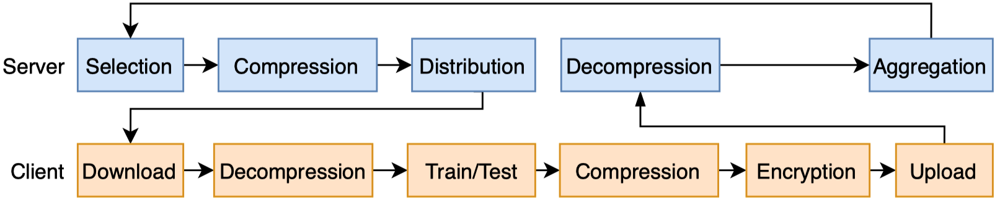

# Tutorial 5: Customize Server and Client

EasyFL abstracts the federated learning (FL) training flow in the server and the client into granular stages, as shown in the image below.



You have the flexibility to customize any stage of the training flow while reusing the rest by implementing a customized server/client.  

## Customize Server

EasyFL implements random client selection and [Federated Averaging](https://arxiv.org/abs/1602.05629) as the aggregation strategy. 
You can customize the server implementation by inheriting [BaseServer](../api.html#easyfl.server.BaseServer) and override specific functions.

Below is an example of a customized server. 
```python
import easyfl
from easyfl.server import BaseServer
from easyfl.server.base import MODEL

class CustomizedServer(BaseServer):
    def __init__(self, conf, **kwargs):
        super(CustomizedServer, self).__init__(conf, **kwargs)
        pass  # more initialization of attributes.
    
    def aggregation(self):
        uploaded_content = self.get_client_uploads()
        models = list(uploaded_content[MODEL].values())
        # Original implementation of aggregation weights
        # weights = list(uploaded_content[DATA_SIZE].values())
        # We can assign the manipulated customized weights in aggregation.   
        customized_weights = list(range(len(models)))
        model = self.aggregate(models, customized_weights)
        self.set_model(model, load_dict=True)

# Register customized server.
easyfl.register_server(CustomizedServer)
# Initialize federated learning with default configurations.
easyfl.init()
# Execute federated learning training.
easyfl.run()
```

Here we list down more useful functions to override to implement a customized server.  

```python
import easyfl
from easyfl.server import BaseServer

class CustomizedServer(BaseServer):
    def __init__(self, conf, **kwargs):
        super(CustomizedServer, self).__init__(conf, **kwargs)
        pass  # more initialization of attributes.
    
    def selection(self, clients, clients_per_round):
        pass  # implement customized client selection algorithm.
    
    def compression(self):
        pass  # implement customized compression algorithm.
    
    def pre_train(self):
        pass  # inject operations before distribution to train.
    
    def post_train(self):
        pass  # inject operations after aggregation.
    
    def pre_test(self):
        pass  # inject operations before distribution to test. 
    
    def post_test(self):
        pass  # inject operations after aggregating testing results.
    
    def decompression(self, model):
        pass  # implement customized decompression algorithm.
    
    def aggregation(self):
        pass  # implement customized aggregation algorithm.
```

Below are some attributes that you may need in implementing the customized server.

`self.conf`: Configurations of EasyFL.

`self._model`: The global model in server, updated after aggregation.

`self._current_round`: The current training round.

`self._clients`: All available clients.

`self.selected_clients`: The selected clients.

You may refer to the [BaseServer](../api.html#easyfl.server.BaseServer) for more functions and class attributes.

## Customize Client

Each client of EasyFL conducts training and testing. 
The implementation of training and testing is similar to normal PyTorch implementation.
We implement training with Adam/SGD optimizer using CrossEntropy loss. 
You can customize client implementation of training and testing by inheriting [BaseClient](../api.html#easyfl.client.BaseClient) and overriding specific functions. 

Below is an example of a customized client. 

```python
import time
import easyfl
from torch import nn
import torch.optim as optim
from easyfl.client.base import BaseClient

# Inherit BaseClient to implement customized client operations.
class CustomizedClient(BaseClient):
    def __init__(self, cid, conf, train_data, test_data, device, **kwargs):
        super(CustomizedClient, self).__init__(cid, conf, train_data, test_data, device, **kwargs)
        # Initialize a classifier for each client.
        self.classifier = nn.Sequential(*[nn.Linear(512, 100)])

    def train(self, conf, device):
        start_time = time.time()
        self.model.classifier.classifier = self.classifier.to(device)
        loss_fn, optimizer = self.pretrain_setup(conf, device)
        self.train_loss = []
        for i in range(conf.local_epoch):
            batch_loss = []
            for batched_x, batched_y in self.train_loader:
                x, y = batched_x.to(device), batched_y.to(device)
                optimizer.zero_grad()
                out = self.model(x)
                loss = loss_fn(out, y)
                loss.backward()
                optimizer.step()
                batch_loss.append(loss.item())
            current_epoch_loss = sum(batch_loss) / len(batch_loss)
            self.train_loss.append(float(current_epoch_loss))
        self.train_time = time.time() - start_time
        # Keep the classifier in clients and upload only the backbone of model. 
        self.classifier = self.model.classifier.classifier
        self.model.classifier.classifier = nn.Sequential()        

    # A customized optimizer that sets different learning rates for different model parts.
    def load_optimizer(self, conf):
        ignored_params = list(map(id, self.model.classifier.parameters()))
        base_params = filter(lambda p: id(p) not in ignored_params, self.model.parameters())
        optimizer = optim.SGD([
            {'params': base_params, 'lr': 0.1 * conf.optimizer.lr},
            {'params': self.model.classifier.parameters(), 'lr': conf.optimizer.lr}
        ], weight_decay=5e-4, momentum=conf.optimizer.momentum, nesterov=True)
        return optimizer

# Register customized client.
easyfl.register_client(CustomizedClient)
# Initialize federated learning with default configurations.
easyfl.init()
# Execute federated learning training.
easyfl.run()
```

Here we list down more useful functions to override to implement a customized client.  

```python
import easyfl
from easyfl.client import BaseClient

# Inherit BaseClient to implement customized client operations.
class CustomizedClient(BaseClient):
    def __init__(self, cid, conf, train_data, test_data, device, **kwargs):
        super(CustomizedClient, self).__init__(cid, conf, train_data, test_data, device, **kwargs)
        pass  # more initialization of attributes.

    def decompression(self):
        pass  # implement decompression method.

    def pre_train(self):
        pass  # inject operations before training. 

    def train(self, conf, device):
        pass  # implement customized training method.
    
    def post_train(self):
        pass  # inject operations after training.
    
    def load_loss_fn(self, conf):
        pass  # load a customized loss function.
        return loss

    def load_optimizer(self, conf):
        pass  # load a customized optimizer
        return optimizer

    def load_loader(self, conf):
        pass  # load a customized data loader.
        return train_loader

    def test_local(self):
        pass  # implement testing of the trained model before uploading to the server.

    def pre_test(self):
        pass  # inject operations before testing. 

    def test(self, conf, device):
        pass  # implement customized testing.
    
    def post_test(self):
        pass  # inject operations after testing.

    def encryption(self):
        pass  # implement customized encryption method.

    def compression(self):
        pass  # implement customized compression method.

    def upload(self):
        pass  # implement customized upload method.

    def post_upload(self):
        pass  # implement customized post upload method.
```

Below are some attributes that you may need in implementing the customized client.

`self.conf`: Configurations of client, under key "client" of config dictionary.

`self.compressed_model`: The model downloaded from the server.

`self.model`: The model used for training.

`self.cid`: The client id.

`self.device`: The device for training. 

`self.train_data`: The training data of the client.

`self.test_data`: The testing data of the client.

You may refer to the [BaseClient](../api.html#easyfl.client.BaseClient) for more functions and class attributes.

## Existing Works

We surveyed 33 papers from recent publications of FL from both the machine learning and system community. 
The following table shows that 10 out of 33 (~30%) publications propose new algorithms with changes in only one stage of the training flow, and the majority (~57%) change only two stages. 
Training flow abstraction you to focus on the problems, without re-implementing the whole FL process.

Annotation of the table: 

_Server stages_: **Sel** -- Selection, **Com** -- Compression, **Agg** -- Aggregation

_Client stages_: **Train**, **Com** -- Compression, **Enc** -- Encryption

| Revenue | Title | Sel | Com | Agg | Train | Com | Enc |
| :--- | :---: | :---: | :---: | :---: | :---: | :---: | ---: |
| INFOCOM'20 | Optimizing Federated Learning on Non-IID Data with Reinforcement Learning | ✓ | | | | | | |
| OSDI'21 | Oort: Informed Participant Selection for Scalable Federated Learning | ✓ | | | | | | |
| HPDC'20 | TiFL: A Tier-based Federated Learning System | ✓ | | | | | | |
| IoT'21 | FedMCCS: Multicriteria Client Selection Model for Optimal IoT Federated Learning | ✓ | | | | | | |
| KDD'20 | FedFast: Going Beyond Average for Faster Training of Federated Recommender Systems | ✓ | | ✓ | | | | |
| TNNLS 2019 | Robust and Communication-Efficient Federated Learning From Non-i.i.d. Data | | ✓ | | | | ✓ | |
| NIPS'20 | Ensemble Distillation for Robust Model Fusion in Federated Learning | | | ✓ | | | | |
| ICDCS 2019 | CMFL: Mitigating Communication Overhead for Federated Learning | | | | | | ✓ | |
| ICML'20 | FetchSGD: Communication-Efficient Federated Learning with Sketching | | | ✓ | | | ✓ | |
| ICML'20 | SCAFFOLD: Stochastic Controlled Averaging for Federated Learning | | | ✓ | | | ✓ | |
| TPDS'20 | FedSCR: Structure-Based Communication Reduction for Federated Learning | | | ✓ | | | ✓ | |
| HotEdge 2018 | eSGD: Communication Efficient Distributed Deep Learning on the Edge | | | | | | ✓ | |
| ICML'20 | Adaptive Federated Optimization | | | | | ✓ | | |
| CVPR'21 | Privacy-preserving Collaborative Learning with Automatic Transformation Search | | | | | ✓ | | |
| MLSys'20 | Federated Optimization in Heterogeneous Networks | | | | | ✓ | | |
| ICLR'20 | Federated Learning with Matched Averaging | | | ✓ | | ✓ | | |
| ACMMM'20 | Performance Optimization for Federated Person Re-identification via Benchmark Analysis | | | ✓ | | ✓ | | |
| NIPS'20 | Distributionally Robust Federated Averaging | | | ✓ | | ✓ | | |
| NIPS'20 | Group Knowledge Transfer: Federated Learning of Large CNNs at the Edge | | | ✓ | | ✓ | | |
| NIPS'20 | Personalized Federated Learning with Moreau Envelopes | | | ✓ | | ✓ | | |
| ICLR'20 | Fair Resource Allocation in Federated Learning | | | ✓ | | ✓ | | |
| ICML'20 | Federated Learning with Only Positive Labels | | | ✓ | | ✓ | | |
| AAAI'21 | Addressing Class Imbalance in Federated Learning | | | ✓ | | ✓ | | |
| AAAI'21 | Federated Block Coordinate Descent Scheme for Learning Global and Personalized Models | | | ✓ | | ✓ | | |
| IoT'20 | Toward Communication-Efficient Federated Learning in the Internet of Things With Edge Computing | | | ✓ | | ✓ | ✓ | |
| ICML'20 | Acceleration for Compressed Gradient Descent in Distributed and Federated Optimization | | | ✓ | | ✓ | ✓ | |
| INFOCOMM 2018 | When Edge Meets Learning: Adaptive Control for Resource-Constrained Distributed Machine Learning | | | ✓ | | ✓ | | |
| ATC'20 | BatchCrypt: Efficient Homomorphic Encryption for Cross-Silo Federated Learning | | | ✓ | | | | ✓ |
| AAAI'21 | FLAME: Differentially Private Federated Learning in the Shuffle Model | | | ✓ | | | | ✓ |
| TIFS'20 | Federated Learning with Differential Privacy: Algorithms and Performance Analysis | | | ✓ | | | | ✓ |
| GLOBECOM'20 | Towards Efficient Secure Aggregation for Model Update in Federated Learning | | | ✓ | | | | ✓ |
| MobiCom'20 | Billion-Scale Federated Learning on Mobile Clients: A Submodel Design with Tunable Privacy | | | ✓ | | ✓ | | ✓ |
| IoT'20 | Privacy-Preserving Federated Learning in Fog Computing | | | ✓ | | ✓ | | ✓ |
