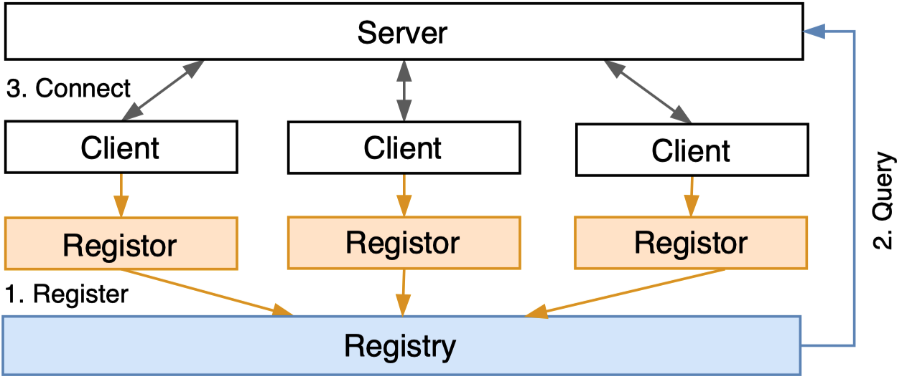

# Tutorial 7: Remote Training

_**Remote training**_ is the scenario where the server and the clients are running on different devices. Standalone and
distributed training are mainly for federated learning (FL) simulation experiments. Remote training brings FL from
experimentation to production.

## Remote Training Example

In remote training, both server and clients are started as gRPC services. Here we provide examples on how to start
server and client services.

Start remote server.

```python
import easyfl

# Configurations for the remote server.
conf = {"is_remote": True, "local_port": 22999}
# Initialize only the configuration.
easyfl.init(conf, init_all=False)
# Start remote server service.
# The remote server waits to be connected with the remote client.
easyfl.start_server()
```

Start remote client 1 with port 23000.

```python
import easyfl

# Configurations for the remote client.
conf = {
    "is_remote": True,
    "local_port": 23000,
    "server_addr": "localhost:22999",
    "index": 0,
}
# Initialize only the configuration.
easyfl.init(conf, init_all=False)
# Start remote client service.
# The remote client waits to be connected with the remote server.
easyfl.start_client()
```

Start remote client 2 with port 23001.

```python
import easyfl

# Configurations for the remote client.
conf = {
    "is_remote": True,
    "local_port": 23001,
    "server_addr": "localhost:22999",
    "index": 1,
}
# Initialize only the configuration.
easyfl.init(conf, init_all=False)
# Start remote client service.
# The remote client waits to be connected with the remote server.
easyfl.start_client()
```

The client service connects to the remote service via specified `server_address`. 
The client service users `index` to decide the data (user) of the configured dataset.

To trigger remote training, we can send gRPC requests to trigger the training operation.

```python
import easyfl
from easyfl.pb import common_pb2 as common_pb
from easyfl.pb import server_service_pb2 as server_pb
from easyfl.protocol import codec
from easyfl.communication import grpc_wrapper
from easyfl.registry.vclient import VirtualClient

server_addr = "localhost:22999"
config = {
    "data": {"dataset": "femnist"},
    "model": "lenet",
    "test_mode": "test_in_client"
}
# Initialize configurations.
easyfl.init(config, init_all=False)
# Initialize the model, using the configured 'lenet'
model = easyfl.init_model()

# Construct gRPC request 
stub = grpc_wrapper.init_stub(grpc_wrapper.TYPE_SERVER, server_addr)
request = server_pb.RunRequest(model=codec.marshal(model))
# The request contains clients' addresses for the server to communicate with the clients.
clients = [VirtualClient("1", "localhost:23000", 0), VirtualClient("2", "localhost:23001", 1)]
for c in clients:
    request.clients.append(server_pb.Client(client_id=c.id, index=c.index, address=c.address))
# Send request to trigger training.
response = stub.Run(request)
result = "Success" if response.status.code == common_pb.SC_OK else response
print(result)
```

Similarly, we can also stop remote training by sending gRPC requests to the server.

```python
from easyfl.communication import grpc_wrapper
from easyfl.pb import common_pb2 as common_pb
from easyfl.pb import server_service_pb2 as server_pb

server_addr = "localhost:22999"
stub = grpc_wrapper.init_stub(grpc_wrapper.TYPE_SERVER, server_addr)
# Send request to stop training.
response = stub.Stop(server_pb.StopRequest())
result = "Success" if response.status.code == common_pb.SC_OK else response
print(result)
```

## Remote Training on Docker and Kubernetes

EasyFL supports deployment of FL training using Docker and Kubernetes.

Since we cannot easily obtain the server and client addresses in Docker or Kubernetes, especially when scaling up the number of clients,
EasyFL provides a service discovery mechanism, as shown in the image below.


It contains registors to dynamically register the clients and the registry to store the client addresses for the server to query. 
The registor gets the addresses of clients and registers them to the registry. 
Since the clients are unaware of the container environment they are running, 
they must rely on a third-party service (the registor) to fetch their container addresses to complete registration. 
The registry stores the registered client addresses for the server to query. 
EasyFL supports two service discovery methods targeting different deployment scenarios: using Docker and using Kubernetes

The following are the deployment manual and the steps to conduct training in Kubernetes.

⚠️ Note: these commands were tested before refactoring. They may not work as expected now. **Need further testing**. 

### Deployment using Docker

Important: Adjust the `Memeory` constrain of docker to be > 11 GB (To be optimized)

1. Build docker images and start services with either docker compose or individual docker containers
2. Start training with a grpc message

#### Build images

```
make base_image
make image
```

Or

```
docker build -t easyfl:base -f docker/base.Dockerfile .
docker build -t easyfl-client -f docker/client.Dockerfile .
docker build -t easyfl-server -f docker/server.Dockerfile .
docker build -t easyfl-run -f docker/run.Dockerfile .
```

#### Start with Docker Compose

Use docker compose to start all services.
```
docker-compose up --scale client=2 && docker-compose rm -fsv
```

Mac users with Docker Desktop > 2.0 may have port conflict occurs because `bind: address already in use`.
The workaround is to run with 
```
docker-compose up && docker-compose rm -fsv
``` 
and start another terminal to scale with 
```
docker-compose up --scale client=2 && docker-compose rm -fsv
```

#### Etcd Setup

```
export NODE1=localhost
export DATA_DIR="etcd-data"
REGISTRY=quay.io/coreos/etcd

docker run --rm \
  -p 23790:2379 \
  -p 23800:2380 \
  --volume=${DATA_DIR}:/etcd-data \
  --name etcd ${REGISTRY}:v3.4.0 \
  /usr/local/bin/etcd \
  --data-dir=/etcd-data --name node1 \
  --initial-advertise-peer-urls http://${NODE1}:2380 --listen-peer-urls http://0.0.0.0:2380 \
  --advertise-client-urls http://${NODE1}:2379 --listen-client-urls http://0.0.0.0:2379 \
  --initial-cluster node1=http://${NODE1}:2380
```

#### Docker Register

```
docker run --name docker-register --rm -d -e HOST_IP=<172.18.0.1> -e ETCD_HOST=<172.17.0.1>:2379 -v /var/run/docker.sock:/var/run/docker.sock -t wingalong/docker-register
```
* HOST_IP: the ip address of network client runs on: gateway in `docker inspect easyfl-client` 
* ETCD_HOST: the ip address of etcd: gateway in `docker inspect etcd`

#### Start containers

```shell
# 1. Start clients
docker run --rm -p 23400:23400 --name client0 --network host -v <dataset_path>/femnist/data:/app/<dataset_path>/femnist/data easyfl-client --index=0 --is-remote=True --local-port=23400 --server-addr="localhost:23501"
docker run --rm -p 23401:23401 --name client1 --network host -v <dataset_path>/femnist/data:/app/<dataset_path>/femnist/data easyfl-client --index=1 --is-remote=True --local-port=23401 --server-addr="localhost:23501"

# 2. Start server
docker run --rm -p 23501:23501 --name easyfl-server --network host  easyfl-server --local-port=23501 --is-remote=True
```

Note: you need to replace the `dataset_path` with your actual dataset directory.

#### Start Training Remotely 
```
docker run --rm --name easyfl-run --network host easyfl-run --server-addr 127.0.0.1:23501 --etcd-addr:127.0.0.1:23790
```
It sends a gRPC message to server to start training.

### Deployment using Kubernetes


```shell
# 1. Deploy tracker
kubectl apply -f kubernetes/tracker.yml

# 2. Deploy server
kubectl apply -f kubernetes/server.yml

# 3. Deploy client
kubectl apply -f kubernetes/client.yml

# 4. Scale client
kubectl scale -n easyfl deployment easyfl-client --replicas=6

# 5. Check pods
kubectl get pods -n easyfl -o wide

# 6. Run

python examples/remote_run.py --server-addr localhost:32501 --source kubernetes

# 7. Check logs
kubectl logs -f -n easyfl easyfl-server

# 8. Get results
python examples/test_services.py --task-id task_ijhwqg

# 9. Save log
kubectl logs -n easyfl easyfl-server > server-log.log

# 10. Stop client/server/tracker
kubectl delete -f kubernetes/client.yml
kubectl delete -f kubernetes/server.yml
kubectl delete -f kubernetes/tracker.yml
```
